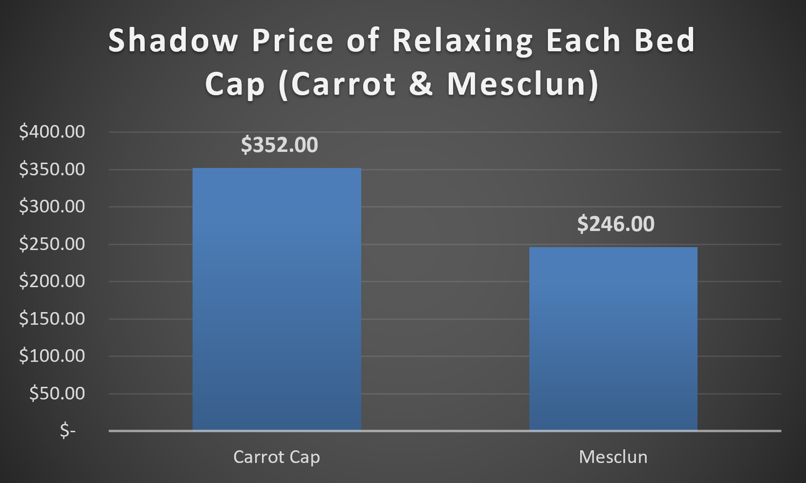
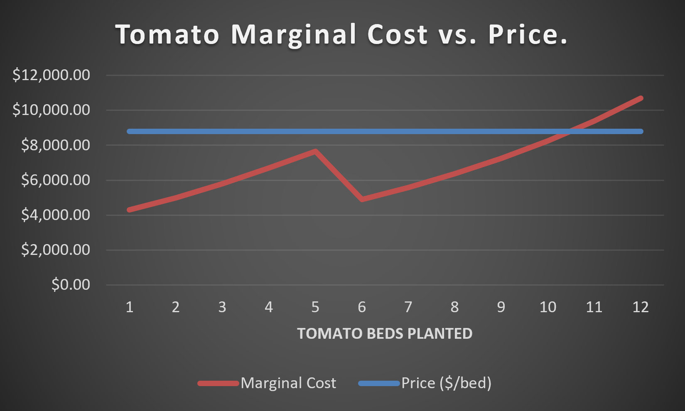

# Perfect Competition — Analysis

## Why tomatoes stop at 10 beds

Tomato production stops at 10 beds because planting an 11th bed would reduce
overall profit. Although each bed generates $8,800 in revenue, the 11th bed
would cost approximately $9,391 to grow, meaning its cost exceeds the revenue
it brings in. As a result, the 11th bed would create a loss of about $591,
making it not worth planting. Therefore, the profit-maximizing decision is to
stop production at 10 beds, where the additional revenue from a bed still
exceeds its cost.

## Which constraints bind, and what relaxing one is worth

The carrot and mesclun bed limits are the constraints that actually bind
because increasing caps for both would increase profit. The shadow prices
show that adding one more carrot bed would increase profit by about $352,
while one more mesclun bed would add about $246. Unlike tomatoes, cost never
actually caught up to price here — the fence caps stopped production first.
The 64-bed land limit and the 4-worker labor limit are slack constraints
since only 60 beds are used and about 3.17 workers' worth of labor is
required, so there would be no benefit to paying to relax either of those
limits.

The chart below compares the shadow prices of the two binding constraints.

## The tomato marginal cost dip around bed 6

Under normal diminishing returns, I would expect the cost of each additional
bed to keep increasing as more beds are planted because each new bed requires
more labor hours than the one before it. However, bed 6 breaks that pattern
and is actually cheaper to grow than both bed 5 and bed 7. This happens
because the farmer's 720 available labor hours are exhausted during bed 5,
so by bed 6 all additional labor comes from a temporary worker who is paid a
lower wage. The lower labor rate reduces the cost of bed 6 enough to outweigh
the effects of diminishing returns for a short time. After that, the number
of hours required per bed continues to rise, and by bed 7 the effects of
diminishing returns become large enough that costs start increasing again.

The chart below shows tomato marginal cost crossing the $8,800 price line around bed 10-11.

## Why it's worth growing crops that lose money on their own

When I tested planting 20 carrot beds by themselves, the farm showed a loss of about $16,489, which at first makes it seem like carrots are not worth growing. However, that loss is mostly caused by assigning the farm's entire $20,000 fixed cost to carrots alone. In reality, the carrots generate $41,880 in revenue while their variable costs are only about $38,369, meaning they still contribute $3,511 toward covering the farm's fixed costs. The same fact shows up as average variable cost. Carrot AVC at 20 beds is $1,918.45, below the $2,094 price. This demonstrates the standard shutdown-rule condition (P > AVC) for staying in production even when a crop isn't covering its share of fixed costs. Since those fixed costs have to be paid whether carrots are planted or not, they should not determine whether carrots are worth growing. As long as price is above AVC, the crop is helping the farm by covering part of its overhead, which is why the optimal solution still includes all 20 carrot beds.

Mesclun holds by the same rule, but not consistently across its whole curve. At 30 beds, mesclun generates $81,000 in revenue against variable costs of about $72,922, contributing roughly $8,078 toward fixed costs. That works out to an AVC of $2,430.74 against a $2,700 price. That's not true everywhere on the curve, though. At beds 13 and 14, mesclun's AVC actually rises above price ($2,716.35 and $2,702.51), so the shutdown rule would technically fail if the farm stopped there. The optimal solution plants all the way to 30 beds, well past the 14th bed. The rule holds for the plan I'm actually recommending, just not for every point on mesclun's cost curve.

## Comparing the model to my Stage 1 hypothesis

My Stage 1 hypothesis was mostly correct, though the miss landed exactly at
the edge of the 4-bed margin I allowed myself. I was also wrong about one
important assumption: I thought the farm should use all 64 available beds.
The model showed that the most profitable solution only uses 60 beds, with
30 mesclun, 20 carrots, and 10 tomatoes. I correctly predicted that tomatoes
would stay below their cap and that mesclun and carrots would be planted at
or near their maximums, but I underestimated how strongly diminishing
returns would affect tomatoes. I assumed any unused land was wasted, when
the model showed that planting the last four beds would actually reduce
profit because the additional tomato beds cost more to produce than the
revenue they generate. That result changed my thinking about optimization:
maximizing profit is not the same as maximizing resource use.
