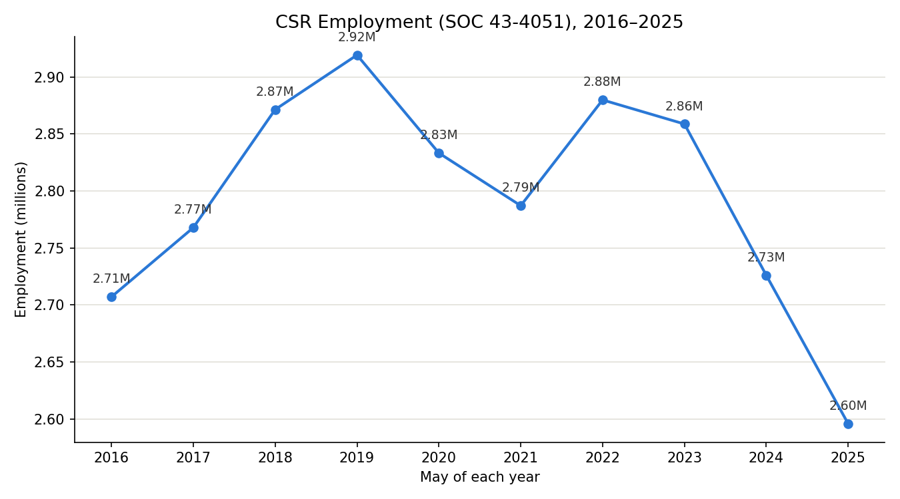
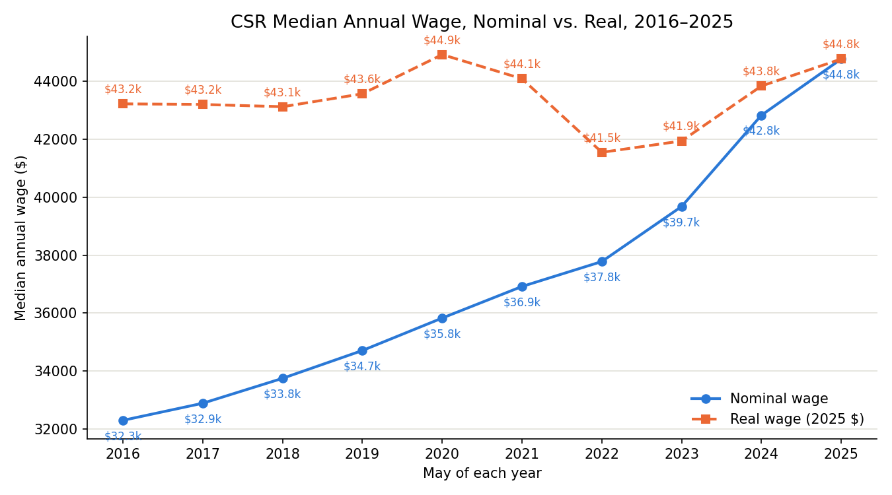

# CSR Employment and Wages, 2016–2025

Source: BLS Occupational Employment and Wage Statistics, SOC 43-4051 (Customer Service Representatives). See `data_sources.xlsx` for the exact URL and retrieval date behind each year.

## Employment

| Year | Employment |
|---|---|
| 2016 | 2,707,040 |
| 2017 | 2,767,790 |
| 2018 | 2,871,400 |
| 2019 | 2,919,230 |
| 2020 | 2,833,250 |
| 2021 | 2,787,070 |
| 2022 | 2,879,840 |
| 2023 | 2,858,710 |
| 2024 | 2,725,930 |
| 2025 | 2,595,750 |

## Wages (nominal vs. real)

Real wages are in 2025 dollars, deflated using CPIAUCNS (May of each year). See `oews_wages_annual.xlsx` for the conversion.

| Year | Nominal Median Wage | Real Median Wage (2025 $) |
|---|---|---|
| 2016 | $32,300 | $43,223 |
| 2017 | $32,890 | $43,202 |
| 2018 | $33,750 | $43,124 |
| 2019 | $34,710 | $43,570 |
| 2020 | $35,830 | $44,923 |
| 2021 | $36,920 | $44,089 |
| 2022 | $37,780 | $41,550 |
| 2023 | $39,680 | $41,942 |
| 2024 | $42,830 | $43,839 |
| 2025 | $44,770 | $44,770 |
